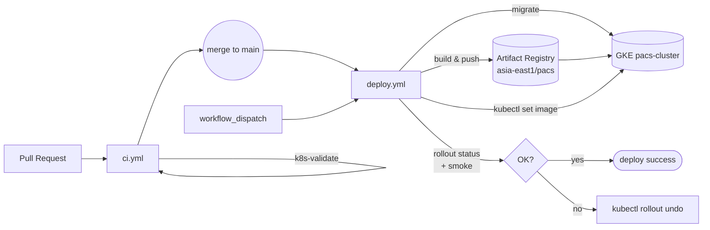

# CI/CD Guide — GitHub Actions × GKE

本文件說明 PACS 的 GitHub Actions CI/CD pipeline 如何運作、首次設定步驟、以及常見維運操作（手動部署、回滾、權限排查）。

## 架構總覽



* **PR → `ci.yml`**：跑 Go 單元測試 + vet + lint + Dockerfile build 驗證 + K8s manifest 驗證；fail 會擋 merge。
* **Merge to `main` → `deploy.yml`**：偵測哪些路徑改了 → 只 build 變動的 image（git SHA tag）→ run migration → `kubectl set image` rolling update → smoke test。失敗會自動 `rollout undo`。
* **workflow\_dispatch**：可手動部署特定 SHA 或單一服務（無需 push）。

認證採 Workload Identity Federation（WIF），全程**不需要 long-lived service account key**。

---

## 初次設定 checklist

> ⚠️ 在 `ci.yml` / `deploy.yml` 推上 GitHub 之前，先完成以下兩段：

### 1. 在 GCP 建立 service account + WIF（一次性）

執行設定腳本：

```bash
PROJECT_ID=extreme-water-497313-j8 \
GITHUB_REPO=zychen1204/FP-PACS-system \
bash scripts/cicd/setup-wif.sh
```

腳本是 **idempotent** 的，可以重複跑。它會：

1. 啟用必要 API（iam / iamcredentials / sts / artifactregistry / container）
2. 建立 service account `pacs-gha-deployer@<PROJECT>.iam.gserviceaccount.com`
3. 授予 `roles/artifactregistry.writer` + `roles/container.developer`（project scope）
4. 建立 WIF pool `github-pool`
5. 建立 OIDC provider `github-provider`（issuer 鎖 `https://token.actions.githubusercontent.com`，attribute condition 鎖目標 repo）
6. 把 repo 的 principalSet 綁定到 SA 上（讓 GitHub workflows 能 impersonate）

腳本結束會印出要設到 GitHub 的 8 個 variables。

#### 若你不是 project owner

`scripts/cicd/setup-wif.sh` 中步驟 3-6 需要 `roles/owner` 或 `roles/resourcemanager.projectIamAdmin`。當前 `lkj20030827@gmail.com` 只有 `roles/editor`，腳本會把它做不到的 5 條指令印出來，請 owner 帳號（`josh48123@gmail.com` 或 `kenneth.lin93@gmail.com`）跑。Owner 跑完後，再以 editor 帳號重跑一次腳本確認全綠。

### 2. 在 GitHub repo 設定 8 個 Actions variables

從 setup-wif.sh 輸出複製，或直接用 `gh CLI`：

```bash
gh variable set GCP_PROJECT_ID   --body "extreme-water-497313-j8"
gh variable set GCP_WIF_PROVIDER --body "projects/675882264477/locations/global/workloadIdentityPools/github-pool/providers/github-provider"
gh variable set GCP_DEPLOYER_SA  --body "pacs-gha-deployer@extreme-water-497313-j8.iam.gserviceaccount.com"
gh variable set GKE_CLUSTER      --body "pacs-cluster"
gh variable set GKE_REGION       --body "asia-east1"
gh variable set GKE_NAMESPACE    --body "pacs"
gh variable set AR_LOCATION      --body "asia-east1"
gh variable set AR_REPO          --body "pacs"
```

| Variable | 用途 |
|----------|------|
| `GCP_PROJECT_ID` | 目標 GCP 專案 |
| `GCP_WIF_PROVIDER` | WIF provider resource name（`projects/.../providers/...`） |
| `GCP_DEPLOYER_SA` | 要 impersonate 的 service account email |
| `GKE_CLUSTER` | 目標 GKE cluster 名 |
| `GKE_REGION` | cluster 所在 region |
| `GKE_NAMESPACE` | 部署 namespace（一般為 `pacs`） |
| `AR_LOCATION` | Artifact Registry 區域 |
| `AR_REPO` | AR repository 名（PACS 用單一 repo `pacs`） |

**全部都是 variables，不是 secrets**——WIF 本身不需要 secret token。

---

## Workflow 觸發規則

### `ci.yml`（PR-gated 品質閘）

* `pull_request` to `main`：必跑
* `push` 到非 `main` 分支：必跑
* 內含 `dorny/paths-filter@v3`，後端沒改就跳過 backend job

### `deploy.yml`（自動部署）

* `push` 到 `main`：自動全流程（detect → build → migrate → set image → smoke）
* `workflow_dispatch`：可選擇參數
  * `sha`：要部署的 commit SHA（預設 `HEAD`）
  * `services`：逗號分隔的服務清單（預設 auto-detect）

---

## 日常操作

### 手動部署特定 SHA

```bash
gh workflow run deploy.yml --ref main -f sha=abc1234
```

### 手動部署單一服務（例如只重 deploy frontend）

```bash
gh workflow run deploy.yml --ref main -f services=frontend
```

### 看 workflow 執行狀態

```bash
gh run list --workflow=deploy.yml --limit 10
gh run watch  # 跟最新一次
```

### 緊急回滾（不等 workflow，立刻退回上版）

```bash
kubectl rollout undo deployment/<svc> -n pacs
# 例如：kubectl rollout undo deployment/access-api -n pacs
```

或回退到指定 revision：

```bash
kubectl rollout history deployment/access-api -n pacs
kubectl rollout undo deployment/access-api -n pacs --to-revision=42
```

### 看 deployment 用的 image

```bash
kubectl get deploy -n pacs -o custom-columns='NAME:.metadata.name,IMAGE:.spec.template.spec.containers[0].image'
```

### 看 AR 上有哪些 image / tag

```bash
make gke-images-list                # 走 Makefile（已對齊 AR 路徑）
# 或：
gcloud artifacts docker images list asia-east1-docker.pkg.dev/extreme-water-497313-j8/pacs --include-tags
```

---

## 常見錯誤排查

### `Error: google-github-actions/auth failed`

* WIF provider attribute condition 通常含 `assertion.repository == 'zychen1204/FP-PACS-system'`；若 repo 改名或被 fork 必須同步更新
* 確認 `id-token: write` 已在 workflow `permissions:` 設定
* 確認 GitHub repo Settings → Actions → General → Workflow permissions 允許 OIDC

### `denied: Permission "artifactregistry.repositories.uploadArtifacts" denied`

* 表示 SA 沒拿到 `roles/artifactregistry.writer`
* 跑 `gcloud projects get-iam-policy extreme-water-497313-j8 --flatten='bindings[].members' --filter='bindings.members:pacs-gha-deployer'` 確認 SA 有哪些 role
* 若缺，請 owner 補上：`gcloud projects add-iam-policy-binding extreme-water-497313-j8 --member=serviceAccount:pacs-gha-deployer@... --role=roles/artifactregistry.writer`

### `Error: deployment "xxx" exceeded its progress deadline`

* 通常是新 image 起不來（panic、config 錯、image pull 失敗）
* workflow 會自動 `kubectl rollout undo`
* 排查：`kubectl describe pod -n pacs <new-pod>` 看 events、`kubectl logs -n pacs <new-pod> --previous`

### `Migration Job already exists`

* `k8s/06-migrations.yaml` 的 Job 是 immutable 的；workflow 在 apply 前會先 `kubectl delete job pacs-migrations --ignore-not-found`
* 若手動 debug 卡住：`kubectl delete job pacs-migrations -n pacs` 後重 apply

---

## 為什麼這樣設計

* **WIF 而非 SA key**：避免 long-lived key 外洩；GitHub OIDC token 每次 workflow 跑都重簽，credential 壽命 ~1 小時。
* **Image tag 用 git SHA**：每次 deploy 在 `Deployment` 留下 rollout revision，`kubectl rollout undo` 一鍵回到上版，且能對應到 commit。
* **`kubectl set image` 而非 `kubectl apply`**：manifest 仍寫 `:latest` 是因為平常本機開發希望拉最新；CI 用 `set image` 把 deployment 改成 SHA tag 觸發 rolling update，留下審計軌跡。
* **路徑過濾**：避免單檔改動觸發全 7 個 service 重 build（每個 backend image build ~30s，全部 build ~3 分鐘）。
* **無 manual approval gate**：使用者要求快速 iteration；若未來想加，把 deploy job 改放 GitHub Environment 並設 required reviewer 即可。

---

## 相關檔案

* `scripts/cicd/setup-wif.sh` — WIF/SA 一次性設定腳本
* `.github/workflows/ci.yml` — PR-gated 品質閘
* `.github/workflows/deploy.yml` — main push 自動部署
* `k8s/06-migrations.yaml` — Database migration Job 定義
* `Makefile`、`deploy-to-gke.sh` — 本機部署 fallback（CI 不依賴）

更新部署架構決策請看 `docs/GKEDeploymentReport.md`。
