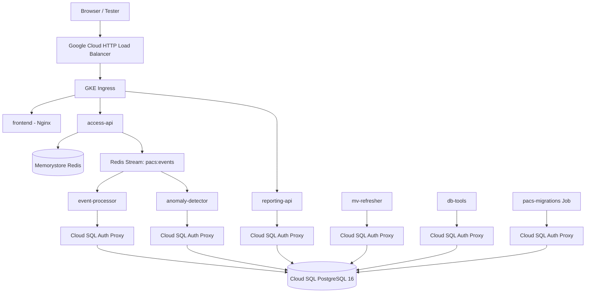

# PACS GKE Cloud Deployment Report

> Project: `My Project 71169`  
> Project ID: `extreme-water-497313-j8`  
> Region: `asia-east1`  
> Cluster: `pacs-cluster`  
> Deployment date: 2026-05-24

## 1. Report Narrative

This report explains how the PACS system was moved from local containers to a Google Cloud GKE deployment. The goal was to prove that the system can run as a cloud-native access control platform with managed database, managed Redis, Kubernetes workloads, automatic scaling, and repeatable deployment scripts.

Recommended presentation order:

1. Problem and goal
   - PACS is a distributed physical access control system.
   - It has a write-heavy path for swipe decisions and a read-heavy path for reports.
   - The cloud goal was to deploy this architecture on managed GCP services and verify performance under shift-change traffic.

2. Cloud architecture
   - GKE runs stateless microservices.
   - Cloud SQL PostgreSQL stores authoritative data and audit logs.
   - Memorystore Redis supports low-latency anti-passback checks and Redis Streams.
   - Cloud SQL Auth Proxy plus Workload Identity gives Pods secure database access without static GCP keys.

3. Deployment process
   - Build Docker images.
   - Push images to Artifact Registry (`asia-east1-docker.pkg.dev/extreme-water-497313-j8/pacs/`). The previous registry `gcr.io/...` was deprecated by Google and migrated away in PR #38.
   - Create or reuse GKE, Cloud SQL, Redis, and the Artifact Registry repository.
   - Create Kubernetes ConfigMaps, Secrets, ServiceAccount, Deployments, Services, HPA, Ingress, and migration Job.

4. Problems encountered and fixes
   - GKE quota issue: default SSD disk usage exceeded `SSD_TOTAL_GB`.
   - Cloud SQL edition issue: `db-custom-2-7680` must explicitly use `ENTERPRISE`.
   - Docker credential helper issue: replaced `gcloud auth configure-docker` dependency with token-based Docker login.
   - ConfigMap size issue: excluded large generated SQL from ConfigMap.
   - Migration issue: changed `migrate up 102` to `migrate goto 102`.
   - Readiness issue: processor services expose `/healthz`, so probes were corrected.

5. Validation
   - All deployments became Available.
   - Database migrations completed with `version=102`, `dirty=false`.
   - 90,000 employee cloud seed completed.
   - k6 shift-burst load test completed successfully.

6. Automated deployment (added 2026-06)
   - `deploy-to-gke.sh` and `make gke-deploy` remain the supported "from-scratch" path for initial cluster bootstrap and disaster recovery.
   - Day-to-day deployment is now driven by GitHub Actions: `.github/workflows/ci.yml` gates every PR (Go test/vet/lint, Dockerfile build, kubeconform), and `.github/workflows/deploy.yml` builds + pushes images + rolls out on every `main` push (with `workflow_dispatch` for ad-hoc SHA/service deploys). See [docs/CICDGuide.md](CICDGuide.md) for the WIF setup and runbook.
   - Image tagging changed from `:latest` (mutable, hard to roll back) to git SHA short tags; `kubectl set image` triggers a real rolling update with `kubectl rollout undo` rollback on failure.
   - Authentication uses Workload Identity Federation (`pacs-gha-deployer@...` impersonated by the GitHub repo principal) — no JSON keys are issued.
   - Manual seed (`scripts/cloud_migrations/`) and large-scale seed (`scripts/migrations/0103_*`) remain out-of-band by design.

## 2. Cloud Architecture



## 3. Deployed Resources

Google Cloud resources:

- GKE regional cluster: `pacs-cluster`
- Cloud SQL PostgreSQL 16 instance: `pacs-pg16`
- Memorystore Redis instance: `pacs-redis`
- Container images in GCR:
  - `pacs-access-api`
  - `pacs-event-processor`
  - `pacs-reporting-api`
  - `pacs-anomaly-detector`
  - `pacs-mv-refresher`
  - `pacs-org-sync`
  - `pacs-frontend`

Kubernetes resources:

- Namespace: `pacs`
- ServiceAccount: `pacs-sa`
- Workloads:
  - `access-api`
  - `reporting-api`
  - `event-processor`
  - `anomaly-detector`
  - `mv-refresher`
  - `frontend`
  - `db-tools`
  - `pacs-migrations`
- Autoscaling:
  - HPA for `access-api`
  - HPA for `reporting-api`
  - HPA for `event-processor`
- Network:
  - `pacs-ingress`
  - NetworkPolicy
  - PodDisruptionBudget

Current external endpoint:

```text
https://34-107-166-43.sslip.io
```

HTTPS endpoint mode is enabled through a GKE managed certificate, global static
IP, and HTTP-to-HTTPS redirect. For this demo deployment, `sslip.io` provides a
public DNS name that resolves to the reserved static IP without a separate
registrar-managed DNS zone.

```bash
make gke-https-generate-demo-domain
make gke-https-demo
make gke-https-smoke DOMAIN_NAME=34-107-166-43.sslip.io
DOMAIN_NAME=34-107-166-43.sslip.io make gke-https-status
```

The reserved global static IP is named `pacs-ingress-ip`:

```bash
gcloud compute addresses describe pacs-ingress-ip --global \
  --format='value(address)'
kubectl describe managedcertificate pacs-managed-cert -n pacs
```

Expected:

```text
address = 34.107.166.43
CertificateStatus = Active
```

Validated command:

```bash
make gke-https-demo PROJECT_ID=extreme-water-497313-j8 CERT_WAIT_TIMEOUT=300
```

Observed result:

```text
Demo HTTPS domain: 34-107-166-43.sslip.io
managedcertificate.networking.gke.io/pacs-managed-cert unchanged
frontendconfig.networking.gke.io/pacs-frontend-config unchanged
ingress.networking.k8s.io/pacs-ingress unchanged
ManagedCertificate status: Active
HTTP redirect: 308 https://34-107-166-43.sslip.io:443/
Smoke testing https://34-107-166-43.sslip.io
Smoke test OK
```

## 4. What Was Changed

### `deploy-to-gke.sh`

The deployment script was made repeatable and cloud-friendly:

- Enables required GCP APIs automatically.
- Uses quota-friendly GKE defaults:
  - `GKE_NUM_NODES=1`
  - `GKE_MIN_NODES=1`
  - `GKE_MAX_NODES=3`
  - `GKE_DISK_TYPE=pd-standard`
  - `GKE_DISK_SIZE=30`
- Explicitly sets Cloud SQL edition:
  - `DB_EDITION=ENTERPRISE`
  - `DB_TIER=db-custom-2-7680`
- Uses token-based Docker login for GCR.
- Adds `BUILD_IMAGES=0` so repeated deploys can skip image rebuilds.
- Adds optional HTTPS mode through GKE `ManagedCertificate`, `FrontendConfig`,
  global static IP, and HTTP-to-HTTPS redirect.
- Adds `make gke-https-demo`, which reserves/reuses `pacs-ingress-ip`, derives
  an `sslip.io` hostname, applies HTTPS resources, waits for the certificate,
  and runs an HTTPS smoke test.
- Avoids putting large generated seed SQL into ConfigMaps.
- Includes `scripts/k6-load-test/lib/` in the k6 ConfigMap.

Why:

- The original GKE defaults exceeded the project SSD quota.
- Cloud SQL defaults now may use `ENTERPRISE_PLUS`, which rejects `db-custom-2-7680`.
- Some environments do not have `docker-credential-gcloud`.
- Kubernetes ConfigMaps have object size limits.
- Re-running the full deployment should be safe and faster.

### `k8s/06-migrations.yaml`

Migration handling was corrected:

- Removed placeholder ConfigMap from the manifest.
- Uses Cloud SQL Auth Proxy as a native sidecar init container.
- Adds `--address=0.0.0.0` so startupProbe can detect the proxy.
- Changes:

```text
migrate up 102
```

to:

```text
migrate goto 102
```

Why:

- `migrate up 102` means "run 102 migration steps", not "run until version 102".
- This accidentally attempted to run `0103_seed_local.up.sql`, which is not intended for cloud deployment.
- The correct cloud baseline is schema version `102`, with large seed handled manually.

### `k8s/05-processors.yaml`

Processor deployment readiness was fixed:

- `event-processor` readiness changed from `/readyz` to `/healthz`.
- `mv-refresher` readiness changed from `/readyz` to `/healthz`.
- Added cloud `anomaly-detector` Deployment.

Why:

- These services expose `/healthz`, not `/readyz`.
- Without the correct probe, Kubernetes kept the Pods Running but not Ready.
- `anomaly-detector` was built and pushed but previously not deployed in the cloud manifest.

### `k8s/07-k6-load-test.yaml`

k6 load test manifest was corrected:

- Removed placeholder ConfigMap from the manifest.
- Explicitly maps ConfigMap keys to paths:
  - `shift_burst.js`
  - `steady_baseline.js`
  - `mixed_read_write.js`
  - `lib/badges.js`
  - `lib/apb_safe.js`

Why:

- The k6 script imports files from `./lib/`.
- Applying a placeholder ConfigMap would overwrite the real k6 script ConfigMap.

### `scripts/cloud_migrations/0104_cloud_seed.up.sql`

The cloud seed validation was corrected:

- Counts only badge IDs matching `^B-[0-9]{6}$`.

Why:

- Existing demo records like `B001`, `B002`, `B011` are lexicographically between `B-000001` and `B-090000`.
- Without the regex filter, the validation counted old demo data and reported `90007` instead of `90000`.

## 5. Deployment Commands

Full deployment:

```bash
./deploy-to-gke.sh extreme-water-497313-j8 asia-east1 pacs-cluster
```

Re-run without rebuilding images:

```bash
BUILD_IMAGES=0 ./deploy-to-gke.sh extreme-water-497313-j8 asia-east1 pacs-cluster
```

Check workloads:

```bash
kubectl get deployments -n pacs
kubectl get pods -n pacs
kubectl get ingress pacs-ingress -n pacs
```

Check migration version:

```bash
kubectl exec -n pacs pod/db-tools -c psql -- \
  psql -v ON_ERROR_STOP=1 -c 'TABLE schema_migrations;'
```

Expected:

```text
version = 102
dirty = false
```

## 6. Cloud Seed

Run the 90,000 employee cloud seed:

```bash
kubectl exec -i -n pacs pod/db-tools -c psql -- \
  psql -v ON_ERROR_STOP=1 < scripts/cloud_migrations/0104_cloud_seed.up.sql
```

Verify:

```bash
kubectl exec -n pacs pod/db-tools -c psql -- \
  psql -v ON_ERROR_STOP=1 -c \
  "SELECT COUNT(*) FILTER (
      WHERE badge_id ~ '^B-[0-9]{6}$'
        AND badge_id BETWEEN 'B-000001' AND 'B-090000'
    ) AS seeded_employees,
    COUNT(*) AS total_employees
   FROM employees;"
```

Observed result:

```text
seeded_employees = 90000
total_employees  = 90008
```

The extra 8 employees are original demo/migration records and are not part of the 90,000 cloud seed set.

## 7. Load Test

Run the shift-burst k6 test:

```bash
kubectl delete job -n pacs k6-shift-burst --ignore-not-found
kubectl apply -f k8s/07-k6-load-test.yaml
kubectl logs -f -n pacs job/k6-shift-burst
```

Observed result:

```text
k6-shift-burst: Complete
requests: 15239
checks: 100%
http_req_failed: 0.00%
swipe p95: 3.55ms
swipe p99: 4.25ms
max: 9.26ms
```

Interpretation:

- The NFR-1 target is `p99 < 50ms`.
- Observed `p99 = 4.25ms`, so the shift-burst write path passed comfortably.
- The test reached a 100 requests/second plateau during the burst.

## 8. How To Shut Down

There are three shutdown levels. Choose based on whether you want to pause the demo or remove billable resources.

### Option A: Pause app workloads, keep infrastructure

This reduces app activity but keeps GKE, Cloud SQL, and Redis running.

```bash
kubectl scale deployment -n pacs access-api --replicas=0
kubectl scale deployment -n pacs reporting-api --replicas=0
kubectl scale deployment -n pacs event-processor --replicas=0
kubectl scale deployment -n pacs anomaly-detector --replicas=0
kubectl scale deployment -n pacs mv-refresher --replicas=0
kubectl scale deployment -n pacs frontend --replicas=0
```

Use this only for short pauses. Cloud SQL, Redis, GKE control plane, and node resources may still cost money.

### Option B: Delete Kubernetes app resources only

This removes the deployed app from the cluster but keeps GKE, Cloud SQL, and Redis.

```bash
kubectl delete namespace pacs
```

Use this when you want to redeploy later to the same infrastructure.

### Option C: Full cleanup of billable cloud resources

This removes the main billable resources created for the demo.

```bash
gcloud container clusters delete pacs-cluster \
  --project=extreme-water-497313-j8 \
  --region=asia-east1 \
  --quiet

gcloud sql instances delete pacs-pg16 \
  --project=extreme-water-497313-j8 \
  --quiet

gcloud redis instances delete pacs-redis \
  --project=extreme-water-497313-j8 \
  --region=asia-east1 \
  --quiet
```

Optional image cleanup:

```bash
gcloud container images list --repository=gcr.io/extreme-water-497313-j8
```

Then delete images you no longer need:

```bash
gcloud container images delete gcr.io/extreme-water-497313-j8/pacs-access-api:latest --quiet
gcloud container images delete gcr.io/extreme-water-497313-j8/pacs-event-processor:latest --quiet
gcloud container images delete gcr.io/extreme-water-497313-j8/pacs-reporting-api:latest --quiet
gcloud container images delete gcr.io/extreme-water-497313-j8/pacs-anomaly-detector:latest --quiet
gcloud container images delete gcr.io/extreme-water-497313-j8/pacs-mv-refresher:latest --quiet
gcloud container images delete gcr.io/extreme-water-497313-j8/pacs-org-sync:latest --quiet
gcloud container images delete gcr.io/extreme-water-497313-j8/pacs-frontend:latest --quiet
```

Recommended after demo:

```bash
gcloud container clusters list --project=extreme-water-497313-j8
gcloud sql instances list --project=extreme-water-497313-j8
gcloud redis instances list --project=extreme-water-497313-j8 --region=asia-east1
```

If the lists are empty or only contain resources you intentionally keep, cleanup is complete.

## 9. Suggested Presentation Script

Short version:

1. "We deployed PACS to GKE using managed GCP services."
2. "The write path is optimized for fast access decisions: access-api talks to Redis first, then events are processed asynchronously."
3. "The read path is separated through reporting-api and PostgreSQL materialized views."
4. "Cloud SQL Auth Proxy and Workload Identity remove static database credentials for infrastructure access."
5. "We fixed cloud-specific issues: quota, Cloud SQL edition, Docker auth, ConfigMap limits, migration semantics, and readiness probes."
6. "The deployment passed a 90,000-employee seed and a k6 shift-burst test."
7. "The k6 result showed p99 swipe latency at 4.25ms, under the 50ms requirement."
8. "Shutdown is documented at three levels: scale down, delete namespace, or full cloud resource cleanup."

## 10. Final Validation Snapshot

Deployments:

```text
access-api         3/3 Available
anomaly-detector   1/1 Available
event-processor    2/2 Available
frontend           2/2 Available
mv-refresher       1/1 Available
reporting-api      2/2 Available
```

Seed:

```text
seeded_employees = 90000
```

Load test:

```text
k6-shift-burst = Complete
p99 swipe latency = 4.25ms
```
