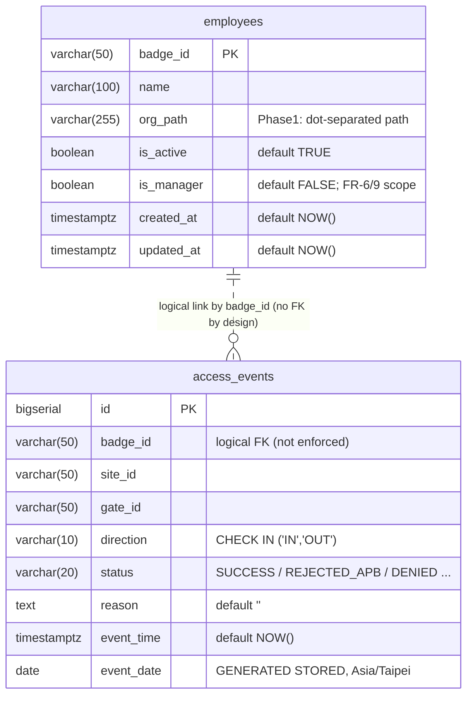

# PACS 資料庫 ERD 與 Schema 規範

> 此文件是 schema 的 **single source of truth (敘述版)**。
> 真正可執行的 DDL 在 `scripts/migrations/`，本文件描述其結構與設計意圖。

## 1. ER 圖（Mermaid）



> `||..o{` 表示「一個 employee 可關聯零或多筆 events」；虛線代表**沒有實體 FK**
> （見 §4 設計理由）。

## 2. 欄位字典

### `access_events`（append-only 稽核日誌）

| 欄位 | 型別 | NOT NULL | DEFAULT | 約束 | 語義 |
|---|---|---|---|---|---|
| `id` | `BIGSERIAL` | ✓ | sequence | PK | 內部識別 |
| `badge_id` | `VARCHAR(50)` | ✓ | - | logical FK | 員工卡號（不下實體 FK） |
| `site_id` | `VARCHAR(50)` | ✓ | - | - | 廠區 |
| `gate_id` | `VARCHAR(50)` | ✓ | - | - | 閘門 |
| `direction` | `VARCHAR(10)` | ✓ | - | `CHECK IN ('IN','OUT')` | 進 / 出 |
| `status` | `VARCHAR(20)` | ✓ | - | - | 決策結果（`SUCCESS` / `REJECTED_APB` / 其他擴充） |
| `reason` | `TEXT` | - | `''` | - | 拒絕或備註原因（FR-3） |
| `event_time` | `TIMESTAMPTZ` | ✓ | `NOW()` | - | 事件發生時間（UTC 內部儲存） |
| `event_date` | `DATE` | (generated) | - | `GENERATED ALWAYS AS ((event_time AT TIME ZONE 'Asia/Taipei')::date) STORED` | 台北當地日期，用於 attendance / audit 索引 |

### `employees`（員工主檔）

| 欄位 | 型別 | NOT NULL | DEFAULT | 約束 | 語義 |
|---|---|---|---|---|---|
| `badge_id` | `VARCHAR(50)` | ✓ | - | PK | 員工卡號 |
| `name` | `VARCHAR(100)` | ✓ | - | - | 姓名 |
| `org_path` | `VARCHAR(255)` | ✓ | `'TSMC'` | - | 組織路徑（dot-separated，如 `TSMC.Fab12.製造部`） |
| `is_active` | `BOOLEAN` | ✓ | `TRUE` | - | 是否在職 |
| `is_manager` | `BOOLEAN` | ✓ | `FALSE` | - | 主管旗標；TRUE 表示其 `org_path` 為 manager scope（FR-6/9）|
| `created_at` | `TIMESTAMPTZ` | ✓ | `NOW()` | - | 建立時間 |
| `updated_at` | `TIMESTAMPTZ` | ✓ | `NOW()` | - | 更新時間 |

## 3. 約束與設計決策

### 3.1 `direction CHECK IN ('IN', 'OUT')`

簡單 CHECK，避免 typo（`'in'`, `'enter'`）混入；其餘擴充走 `status` 欄位。

### 3.2 `event_date` 是 STORED generated column

```sql
event_date DATE GENERATED ALWAYS AS
    ((event_time AT TIME ZONE 'Asia/Taipei')::date) STORED
```

**為何 STORED 而非 functional index**：

- 可被任何索引直接命中（functional index 只能配合**完全相同**的 expression）
- 報表 query 改寫成 `WHERE event_date = ?` 後不再需要 `event_time::date` cast
- 自然修掉 backend `GROUP BY event_time::date` 與 `SELECT event_time::date` 對齊不嚴格的潛在 bug

**為何 `Asia/Taipei`**：TSMC 為台灣場域；UTC 8pm 是隔天台北 4am，若用
server locale 會引發「日期歸屬」歧義。明確標註時區可避免此類 bug。

成本：每筆 +4 bytes，Phase 2（30M rows）≈ 120 MB，可接受。

### 3.3 `access_events.badge_id` 不下實體 FK（刻意設計）

未註冊 badge 的事件**是合法 audit record**：

> 陌生人在凌晨 02:14 嘗試刷 gate 3 — 這是必須記錄的安全事件，
> 不能因為 `badge_id` 不在 `employees` 中就 reject INSERT。

如果加 FK，event-processor 會收到 FK violation 而把事件丟回 DLQ，
反而違反 FR-12 append-only 的精神。

### 3.4 `is_manager` flag — 主管識別與 LIKE prefix scope（FR-6 / FR-9）

`employees` 加 `is_manager BOOLEAN` 是 FR-6（階層團隊報表）與
FR-9（階層資料權限）在 DB 層的支援。一個 manager 的 scope **隱式**定義為：

> manager 的 `org_path` + 任何以該 path 為前綴的子路徑

查詢樣板（pattern a，兩段式）：

```sql
-- Step 1: 驗證 caller 是主管 + 取 scope（backend 對空結果回 403）
SELECT org_path FROM employees
WHERE badge_id = $1 AND is_manager = TRUE AND is_active = TRUE;

-- Step 2: 用 Step 1 的 path 過濾子樹
SELECT ... FROM employees e ...
WHERE e.org_path = $2 OR e.org_path LIKE $2 || '.%';
```

**為何用 path enumeration 而非 adjacency list（HW2 §5.2 字面選型）**：

| 維度 | adjacency list（`parent_id` 自參照）| path enumeration（`org_path` 字串）|
|---|---|---|
| 查子樹 | recursive CTE，計畫不穩定 | B-tree LIKE prefix range scan |
| Phase 1 1k DAU 規模 | 過度設計 | 簡單夠用 |
| Cycle 風險 | 需要防護 | 無此問題 |
| 直接知道「誰報告給誰」 | ✓ | ✗（但 spec 沒這需求）|

評估後採 path enumeration + manager flag。Phase 2 規模若 reporting GROUP BY
拖慢，再升 closure table（兩者並存過渡，最後 DROP `org_path`）。

### 3.5 為何 `is_manager` 不另建 index

只有 2 種值，選擇性過低；所有 manager-scope 查詢都是
`WHERE badge_id = $1 AND is_manager = TRUE`，已走 `employees_pkey`。
Index 反而增加寫入成本卻無 read 收益。

## 4. 索引清單

所有索引都在 baseline migration `0001_init_schema` 中建立。

| 索引 | 欄位 | 條件 | 用途 |
|---|---|---|---|
| `access_events_pkey` | `id` | - | PK |
| `idx_events_badge_date` | `badge_id, event_time` | - | 含明確時間排序的 audit trail 查詢（如 `ORDER BY event_time DESC LIMIT N`） |
| `idx_events_site` | `site_id, event_time` | - | 按廠區查詢 |
| `idx_events_status_date` | `event_date, badge_id` | `WHERE status = 'SUCCESS'` | **attendance 報表**（NFR-2 主目標） |
| `idx_events_badge_eventdate` | `badge_id, event_date DESC` | - | **audit trail 查詢純按日期過濾**（FR-13、NFR-2） |
| `employees_pkey` | `badge_id` | - | PK |

> 不另建 `idx_events_status`（status 只有 SUCCESS / REJECTED_APB 兩種主要值，
> 選擇度過低；按 status 過濾的查詢由 partial index `idx_events_status_date` 涵蓋）。

## 5. 觸發器（FR-12 強制）

| Trigger | 時機 | 動作 |
|---|---|---|
| `trg_protect_audit` | `BEFORE UPDATE OR DELETE ON access_events` (FOR EACH STATEMENT) | `RAISE EXCEPTION 'Updates and deletes are not allowed ...'` |
| `trg_protect_audit_truncate` | `BEFORE TRUNCATE ON access_events` (FOR EACH STATEMENT) | 同 function，補 row-level trigger 不會觸發 TRUNCATE 的旁路 |

兩個 trigger 共用 `protect_audit_log()` function。

## 6. 角色與權限矩陣

| Role | 由誰建立 | `access_events` | `employees` | 用途 |
|---|---|---|---|---|
| `pacs_user` | postgres image (`POSTGRES_USER`) | `SELECT, INSERT`（`UPDATE/DELETE` REVOKE + trigger 阻擋） | `SELECT` | event-processor（寫事件） |
| `pacs_reporter` | migration `0001` | `SELECT` | `SELECT` | reporting-api（最小權限） |

`access-api` **完全不連 PostgreSQL**（走 Redis cache + Stream）。

## 7. Migration 結構

```
0001_init_schema         ── baseline：tables、indexes、triggers、REVOKE、pacs_reporter role、5 員工 seed
0002_add_manager_flag    ── FR-6/9 schema gap：is_manager flag + 1 廠長 + 2 部員 seed
0099_dev_seed            ── 45 筆 demo events（reason='[DEV_SEED]'）
```

`0001` 與 `0002` 都有對應 `.down.sql`（0002 完全 reverse — DELETE 3 員工 + DROP COLUMN），
但 `0099_dev_seed.down.sql` 因 FR-12 immutability 不允許 DELETE 而為 no-op；
要重置 demo 資料請用 `docker compose down -v`。

未來 Phase 2 升級（partitioning、closure table、materialised view）會以
新 migration（`0003` 起）逐項加入而**不再回頭拆 baseline**。詳細工程規範：
[`scripts/README.md`](../scripts/README.md)。

## 8. Phase 2 升級預留

| 物件 | 何時加 | 怎麼加 | 影響 |
|---|---|---|---|
| `access_events` 按月 partitioning | 表 > 5 GB | 新 migration：建 partitioned 副本 → INSERT INTO ... SELECT → rename → 重掛 trigger | 一次性 maintenance window |
| `org_relations` (closure table) | 組織深度 > 5 或 hierarchical query 變多 — Phase 1 規模下 `is_manager` + `org_path` LIKE 已能 cover，**未必需要升級** | 新表：`(ancestor_id, descendant_id, distance)` + 觸發器同步 | 與 `org_path` 並存過渡，最後 DROP `org_path` 並改寫主管查詢 |
| `mv_daily_attendance` | reporting P95 開始接近 200 ms | `CREATE MATERIALIZED VIEW ... REFRESH 5min` | reporting-api query 改指此 MV |

操作 playbook：[`scripts/README.md`](../scripts/README.md) §"Phase 2 partitioning playbook"。

## 9. 真實 schema 對照

從正在運行的資料庫驗證 schema 是否與本文件一致：

```bash
docker compose exec postgres psql -U pacs_user -d pacs_db -c "\d access_events"
docker compose exec postgres psql -U pacs_user -d pacs_db -c "\d employees"
docker compose exec postgres psql -U pacs_user -d pacs_db -c "\di"
```

實測輸出見 [database-compliance.md](database-compliance.md)。
