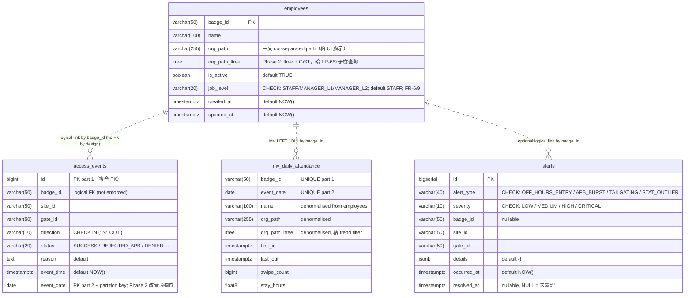

# PACS 資料庫 ERD 與 Schema 規範

> 此文件是 schema 的 **single source of truth (敘述版)**。
> 真正可執行的 DDL 在 `scripts/migrations/`（0001~0006 + 0099 dev_seed），本文件描述其結構與設計意圖。
>
> **狀態**：Phase 2 schema 已全部落地。

## 1. ER 圖（Mermaid）



> `||..o{` 表示「一個 employee 可關聯零或多筆 events / alerts / MV rows」；
> 虛線代表**沒有實體 FK**（見 §3.3 設計理由）。

## 2. 欄位字典

### 2.1 `access_events`（append-only 稽核日誌，按月 partition）

| 欄位 | 型別 | NOT NULL | DEFAULT | 約束 | 語義 |
|---|---|---|---|---|---|
| `id` | `BIGINT` | ✓ | `nextval('access_events_id_seq')` | PK part 1 | 內部識別 |
| `badge_id` | `VARCHAR(50)` | ✓ | - | logical FK | 員工卡號（不下實體 FK） |
| `site_id` | `VARCHAR(50)` | ✓ | - | - | 廠區 |
| `gate_id` | `VARCHAR(50)` | ✓ | - | - | 閘門 |
| `direction` | `VARCHAR(10)` | ✓ | - | `CHECK IN ('IN','OUT')` | 進 / 出 |
| `status` | `VARCHAR(20)` | ✓ | - | - | 決策結果（`SUCCESS` / `REJECTED_APB` / 其他擴充） |
| `reason` | `TEXT` | - | `''` | - | 拒絕或備註原因（FR-3） |
| `event_time` | `TIMESTAMPTZ` | ✓ | `NOW()` | - | 事件發生時間（UTC 內部儲存） |
| `event_date` | `DATE` | ✓ | - | PK part 2 + **partition key** | 台北當地日期，由呼叫端在 INSERT 顯式提供 `(event_time AT TIME ZONE 'Asia/Taipei')::date` |

`PRIMARY KEY (id, event_date)`：partition by range 要求 partition key 在 PK 中。

### 2.2 `employees`（員工主檔）

| 欄位 | 型別 | NOT NULL | DEFAULT | 約束 | 語義 |
|---|---|---|---|---|---|
| `badge_id` | `VARCHAR(50)` | ✓ | - | PK | 員工卡號 |
| `name` | `VARCHAR(100)` | ✓ | - | - | 姓名 |
| `org_path` | `VARCHAR(255)` | ✓ | `'TSMC'` | - | 組織路徑（中文 dot-separated，如 `TSMC.Fab12.製造部`，給 UI 顯示） |
| `org_path_ltree` | `LTREE` | ✓ | - | - | 與 `org_path` 內容同步的 ltree 表示，給 FR-6/9 子樹查詢（GiST index 加速）|
| `is_active` | `BOOLEAN` | ✓ | `TRUE` | - | 是否在職 |
| `job_level` | `VARCHAR(20)` | ✓ | `'STAFF'` | `CHECK IN ('STAFF','MANAGER_L1','MANAGER_L2')` | 職等；`STAFF`=員工、`MANAGER_L1`=一級主管（例：廠長）、`MANAGER_L2`=二級主管（例：部主管）。非 `STAFF` 者其 `org_path_ltree` 即 manager scope（FR-6/9） |
| `created_at` | `TIMESTAMPTZ` | ✓ | `NOW()` | - | 建立時間 |
| `updated_at` | `TIMESTAMPTZ` | ✓ | `NOW()` | - | 更新時間 |

`trg_sync_org_path_ltree` BEFORE INSERT OR UPDATE OF `org_path` 自動同步 `org_path_ltree`。

### 2.3 `alerts`（FR-11 異常警報，Phase 2 新增）

| 欄位 | 型別 | NOT NULL | DEFAULT | 約束 | 語義 |
|---|---|---|---|---|---|
| `id` | `BIGSERIAL` | ✓ | sequence | PK | 內部識別 |
| `alert_type` | `VARCHAR(40)` | ✓ | - | `CHECK IN ('OFF_HOURS_ENTRY', 'APB_BURST', 'TAILGATING', 'STAT_OUTLIER')` | 異常類別 |
| `severity` | `VARCHAR(10)` | ✓ | `'MEDIUM'` | `CHECK IN ('LOW','MEDIUM','HIGH','CRITICAL')` | 嚴重度 |
| `badge_id` | `VARCHAR(50)` | - | - | - | 對應員工（部分異常無對應人員）|
| `site_id` | `VARCHAR(50)` | - | - | - | 廠區 |
| `gate_id` | `VARCHAR(50)` | - | - | - | 閘門 |
| `details` | `JSONB` | ✓ | `'{}'` | - | 規則特定 metadata（例：`{"count_window_minutes": 30}`）|
| `occurred_at` | `TIMESTAMPTZ` | ✓ | `NOW()` | - | 發生時間 |
| `resolved_at` | `TIMESTAMPTZ` | - | - | - | NULL = 未處理 |

寫入者：`anomaly-detector`（用 `pacs_user` 連線）。讀取者：`reporting-api` `/v1/alerts`（用 `pacs_reporter`）。

### 2.4 `mv_daily_attendance`（FR-7 趨勢報表 MV，Phase 2 新增）

| 欄位 | 型別 | 來源 | 語義 |
|---|---|---|---|
| `badge_id` | `VARCHAR(50)` | `access_events.badge_id` | UNIQUE part 1 |
| `event_date` | `DATE` | `access_events.event_date` | UNIQUE part 2 |
| `name` | `VARCHAR(100)` | `employees.name` (LEFT JOIN) | denormalised |
| `org_path` | `VARCHAR(255)` | `employees.org_path` | denormalised |
| `org_path_ltree` | `LTREE` | `employees.org_path_ltree` | denormalised，給 trend `<@` filter |
| `first_in` | `TIMESTAMPTZ` | `MIN(event_time) FILTER (direction='IN')` | 當日首次刷卡進入 |
| `last_out` | `TIMESTAMPTZ` | `MAX(event_time) FILTER (direction='OUT')` | 當日最後刷卡離開 |
| `swipe_count` | `BIGINT` | `COUNT(*)` | 當日刷卡次數（含 reject 不算，WHERE status='SUCCESS'）|
| `stay_hours` | `FLOAT8` | LAG window function 配對 IN→OUT 累加（migration `0105`，取代 0006 baseline 的 `last_out - first_in`）| 當日在廠停留時數，扣除午餐 / 外出時段 |

由 `mv-refresher` service 每 5 min 跑 `REFRESH MATERIALIZED VIEW CONCURRENTLY mv_daily_attendance`。

## 3. 約束與設計決策

### 3.1 `direction CHECK IN ('IN', 'OUT')`

簡單 CHECK，避免 typo（`'in'`, `'enter'`）混入；其餘擴充走 `status` 欄位。

### 3.2 `event_date` 是普通 DATE NOT NULL + 由呼叫端顯式提供（Phase 2 改動）

**Phase 1 原狀**：`event_date DATE GENERATED ALWAYS AS ((event_time AT TIME ZONE 'Asia/Taipei')::date) STORED`。

**Phase 2 改動**：partition by range 要求 partition key 不能是 generated column；
嘗試用 BEFORE INSERT row trigger 自動填也失敗（partition tuple routing 在 BEFORE
row trigger 之前 fire）。最終解法：

- `event_date DATE NOT NULL`（普通欄位）
- 呼叫端（`event-processor` 的 `InsertEvent` / 0099 dev_seed）在 INSERT 時明確提供
  `(event_time AT TIME ZONE 'Asia/Taipei')::date`
- 語意與舊 STORED generated 完全等價

**為何 `Asia/Taipei`**：TSMC 為台灣場域；UTC 8pm 是隔天台北 4am，若用 server locale
會引發「日期歸屬」歧義。明確標註時區可避免此類 bug。

### 3.3 `access_events.badge_id` 不下實體 FK（刻意設計）

未註冊 badge 的事件**是合法 audit record**：

> 陌生人在凌晨 02:14 嘗試刷 gate 3 — 這是必須記錄的安全事件，
> 不能因為 `badge_id` 不在 `employees` 中就 reject INSERT。

如果加 FK，event-processor 會收到 FK violation 而把事件丟回 DLQ，
反而違反 FR-12 append-only 的精神。

### 3.4 `job_level` — 主管識別（多階層）

`employees.job_level VARCHAR(20)` 是 FR-6（階層團隊報表）與 FR-9（階層資料權限）
在 DB 層的支援，取代早期 `is_manager BOOLEAN`（migration `0102`）。值集合：

| 值 | 中文 | 例 |
|---|---|---|
| `STAFF` | 員工 | 一般員工 |
| `MANAGER_L1` | 一級主管 | 廠長 |
| `MANAGER_L2` | 二級主管 | 部主管 |

**權限語意不變**：一個 manager 的 scope 仍**隱式**定義為其 `org_path_ltree`
+ 子樹（`<@` 運算子）。`job_level` 是「身分標籤」，**不**改變可見範圍。
未來新增 `MANAGER_L3` 只需 `ALTER TABLE ... DROP CONSTRAINT + ADD CONSTRAINT`
更新 CHECK，不動 backend 查詢邏輯。

查詢樣板（pattern a，兩段式）：

```sql
-- Step 1: 驗證 caller 是主管 + 取 scope（backend 對空結果回 403）
SELECT org_path_ltree::text FROM employees
WHERE badge_id = $1 AND job_level <> 'STAFF' AND is_active = TRUE;

-- Step 2: 用 Step 1 的 path 過濾子樹（命中 GiST index）
SELECT ... FROM mv_daily_attendance
WHERE org_path_ltree <@ $2::ltree;
```

### 3.5 為何 `job_level` 不另建 index

只有 3 種值（之後即使擴充到 5~10 種），選擇性過低；所有 manager-scope 查詢都是
`WHERE badge_id = $1 AND job_level <> 'STAFF'`，已走 `employees_pkey`。
Index 反而增加寫入成本卻無 read 收益。

### 3.6 組織樹編碼：Phase 2 升級為 ltree + GiST

**為何升 ltree**：HW2 §5.2 / §5.3 明列 `employees.path 採 ltree + GiST index`。
Phase 1 baseline 為求快速曾用 path enumeration（`VARCHAR LIKE prefix`）；
Phase 2 對齊 HW2 規格升 ltree。

實作上保留**雙欄位**：

| 欄位 | 用途 |
|---|---|
| `org_path` VARCHAR | UI 顯示（中文，例 `TSMC.Fab12.製造部`）|
| `org_path_ltree` LTREE | 查詢加速（`<@` ancestor、`@>` descendant、GiST index）|

由 `trg_sync_org_path_ltree` BEFORE INSERT/UPDATE 自動同步：上游服務（org-sync、
手動 SQL）只需要寫 `org_path` VARCHAR，trigger 把 ltree 同步到位。

**PG 16 + C.UTF-8 locale**：PostgreSQL ltree 在 PG 15 不接受中文 label，PG 16 +
UTF-8 locale 接受。docker-compose 已升 `postgres:16-alpine` + `LANG: C.UTF-8`。

### 3.7 按月 partition by range（Phase 2 新增）

`access_events` 改為：

```sql
PRIMARY KEY (id, event_date)
PARTITION BY RANGE (event_date)
```

預建 2025-01 ~ 2027-12 共 **36 個月份分區**（`access_events_y2025m01` ~ `access_events_y2027m12`）。

效益：
- 查詢自動 partition pruning（35/36 partition removed），index footprint flat
- VACUUM 範圍縮在當月 partition
- 未來 archive：直接 DETACH 舊月份 partition → 移到 Cloud Storage

FR-12 trigger（`trg_protect_audit` / `trg_protect_audit_truncate`）重掛到 partitioned root。

### 3.8 alerts CHECK 列舉與 JSONB details

`alert_type` 用 CHECK 列舉避免 typo；`details JSONB` 給規則特定 metadata，
未來新增 metadata 欄位不用改 schema。

## 4. 索引清單

baseline migration `0001` 與 Phase 2 migrations `0003`/`0004`/`0005`/`0006` 中建立。

| 索引 | 表 | 欄位 | 條件 | 用途 |
|---|---|---|---|---|
| `access_events_new_pkey` | `access_events` | `(id, event_date)` | - | PK（含 partition key） |
| `idx_events_badge_date` | `access_events` | `(badge_id, event_time)` | - | audit trail with explicit time ordering（`ORDER BY event_time DESC LIMIT N`） |
| `idx_events_site` | `access_events` | `(site_id, event_time)` | - | 按廠區查詢 |
| `idx_events_status_date` | `access_events` | `(event_date, badge_id)` | `WHERE status = 'SUCCESS'` | **attendance 報表**（NFR-2 主目標） |
| `idx_events_badge_eventdate` | `access_events` | `(badge_id, event_date DESC)` | - | **audit trail 按日期過濾**（FR-13、NFR-2） |
| `employees_pkey` | `employees` | `(badge_id)` | - | PK |
| `idx_employees_org_path_gist` | `employees` | `org_path_ltree` | - | **FR-6/9 ancestor 子樹查詢**（GiST） |
| `alerts_pkey` | `alerts` | `(id)` | - | PK |
| `idx_alerts_open_recent` | `alerts` | `(resolved_at NULLS FIRST, occurred_at DESC)` | - | 「未處理優先 + 時間倒序」列表 |
| `idx_alerts_badge` | `alerts` | `(badge_id, occurred_at DESC)` | `WHERE badge_id IS NOT NULL` | 按員工查警報 |
| `idx_mv_daily_attendance_pk` | `mv_daily_attendance` | `(badge_id, event_date)` UNIQUE | - | REFRESH CONCURRENTLY 必需 |
| `idx_mv_daily_attendance_org_date` | `mv_daily_attendance` | `org_path_ltree` | - | trend `<@` filter（GiST） |
| `idx_mv_daily_attendance_event_date` | `mv_daily_attendance` | `(event_date)` | - | date_trunc trend bucket |

> 不另建 `idx_events_status`（status 只有 SUCCESS / REJECTED_APB 兩種主要值，
> 選擇度過低；按 status 過濾的查詢由 partial index `idx_events_status_date` 涵蓋）。
> `access_events` 上的索引由 PG 自動傳播到 36 個 partition（partition-local index）。

## 5. 觸發器

| Trigger | 表 | 時機 | 動作 |
|---|---|---|---|
| `trg_protect_audit` | `access_events` (partition root) | `BEFORE UPDATE OR DELETE` (FOR EACH STATEMENT) | `RAISE EXCEPTION 'Updates and deletes are not allowed ...'` |
| `trg_protect_audit_truncate` | `access_events` (partition root) | `BEFORE TRUNCATE` (FOR EACH STATEMENT) | 同 function，補 row-level trigger 不會觸發 TRUNCATE 的旁路 |
| `trg_sync_org_path_ltree` | `employees` | `BEFORE INSERT OR UPDATE OF org_path` (FOR EACH ROW) | `NEW.org_path_ltree := NEW.org_path::ltree` |

前兩個共用 `protect_audit_log()` function（baseline `0001`，Phase 2 在 partition swap 後重掛到 partition root）。

## 6. 角色與權限矩陣

| Role | 由誰建立 | `access_events` | `employees` | `alerts` | `mv_daily_attendance` | 用途 |
|---|---|---|---|---|---|---|
| `pacs_user` | postgres image (`POSTGRES_USER`) | `SELECT, INSERT`（`UPDATE/DELETE` REVOKE + trigger 阻擋） | `SELECT, INSERT, UPDATE`（owner）| `SELECT, INSERT` | owner（可 REFRESH） | event-processor / anomaly-detector / mv-refresher / org-sync / migrate |
| `pacs_reporter` | migration `0001` | `SELECT` | `SELECT` | `SELECT` | `SELECT` | reporting-api（最小權限） |

`access-api` **完全不連 PostgreSQL**（走 Redis cache + Stream）。

## 7. Migration 結構

```
0001_init_schema         ── baseline：tables、indexes、triggers、REVOKE、pacs_reporter role、5 員工 seed
0002_add_manager_flag    ── FR-6/9 schema gap：is_manager flag + 1 廠長 + 2 部員 seed（後被 0102 取代）
0003_ltree_org_path      ── Phase 2：ltree extension + org_path_ltree + GiST + 同步 trigger
0004_alerts_table        ── Phase 2：FR-11 alerts 表
0005_partition_access_events ── Phase 2：access_events 按月 partition（36 個月）+ event_date 改普通欄位
0006_mv_daily_attendance ── Phase 2：mv_daily_attendance + unique/GiST 索引
0099_dev_seed            ── 45+ 筆 demo events（reason='[DEV_SEED]'）+ REFRESH MV
0100_protect_access_event_partitions ── 把 FR-12 trigger 重掛到每個 partition child
0101_access_event_partition_safety   ── partition 安全網（default partition + helper functions）
0102_replace_is_manager_with_job_level ── 以 VARCHAR + CHECK 的多階 job_level 取代二元 is_manager
0103_seed_local          ── Phase 1 baseline seed：1k 員工 + 部門結構（docker compose 自動執行）
0105_fix_stay_hours_aggregation ── FR-5 fix：stay_hours 改 LAG window 配對 IN→OUT 累加

cloud_migrations/
0104_cloud_seed          ── Phase 3 規模 seed：90k 員工（手動執行，非 auto-migrate）
```

每支 migration 都有對應 `.down.sql`（`0099` / `0103` / `0104` 因 FR-12 immutability 不允許 DELETE 而為 no-op；要重置 demo 資料請用 `docker compose down -v`）。

未來 Phase 3 升級（read replica、archive、AlloyDB / BigQuery）會以新 migration（`0106` 起）逐項加入。詳細工程規範：[`scripts/README.md`](../scripts/README.md)。

## 8. Phase 2 落地狀態（已完成）

| 升級項 | 落實位置 | 狀態 |
|---|---|:---:|
| 按月 partition (`access_events`) | migration `0005` | ✅ |
| `mv_daily_attendance` materialized view | migration `0006` + `mv-refresher` service | ✅ |
| ltree + GiST | migration `0003` + `trg_sync_org_path_ltree` | ✅ |
| `alerts` 表 (FR-11) | migration `0004` + `anomaly-detector` service | ✅ |
| MQ DLQ (`pacs:events:dead`) | `backend/internal/queue/stream.go` | ✅ |
| Read Replica（docker network alias）| `docker-compose.yml` `postgres-replica` alias | ⚠️ demo 簡化（指同 DB；正式環境換 Cloud SQL HA）|

Phase 3 預留：見 [`database-spec.md`](database-spec.md) §6。

## 9. 真實 schema 對照

從正在運行的資料庫驗證 schema 是否與本文件一致：

```bash
docker compose exec postgres psql -U pacs_user -d pacs_db -c "\d access_events"
docker compose exec postgres psql -U pacs_user -d pacs_db -c "\d employees"
docker compose exec postgres psql -U pacs_user -d pacs_db -c "\d alerts"
docker compose exec postgres psql -U pacs_user -d pacs_db -c "\d mv_daily_attendance"
docker compose exec postgres psql -U pacs_user -d pacs_db -c "\di"
docker compose exec postgres psql -U pacs_user -d pacs_db -c \
  "SELECT count(*) FROM pg_class WHERE relname LIKE 'access_events_y%' AND relkind='r';"
# → 36 個 partition
```

實測輸出見 [`database-compliance.md`](database-compliance.md) 與
[`PHASE2_VERIFICATION.md`](PHASE2_VERIFICATION.md)。
